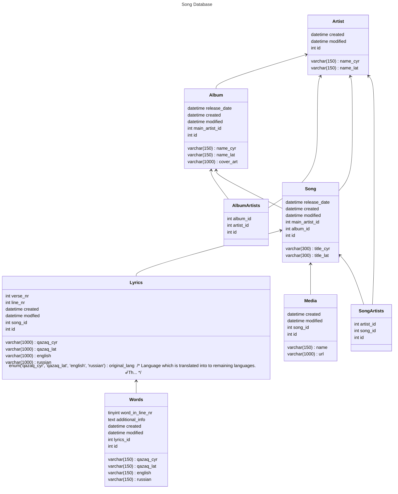

# Qazaq Genius

```mermaid
---
title: Song Database
---
classDiagram
direction BT
class Album {
   varchar(150) name_cyr
   varchar(150) name_lat
   varchar(1000) cover_art
   datetime release_date
   datetime created
   datetime modified
   int main_artist_id
   int id
}
class AlbumArtists {
   int album_id
   int artist_id
   int id
}
class Artist {
   varchar(150) name_cyr
   varchar(150) name_lat
   datetime created
   datetime modified
   int id
}
class Lyrics {
   int verse_nr
   int line_nr
   varchar(1000) qazaq_cyr
   varchar(1000) qazaq_lat
   varchar(1000) english
   varchar(1000) russian
   enum('qazaq_cyr', 'qazaq_lat', 'english', 'russian') original_lang  /* Language which is translated into to remaining languages. ↲Th... */
   datetime created
   datetime modfied
   int song_id
   int id
}
class Media {
   varchar(150) name
   varchar(1000) url
   datetime created
   datetime modified
   int song_id
   int id
}
class Song {
   varchar(300) title_cyr
   varchar(300) title_lat
   datetime release_date
   datetime created
   datetime modified
   int main_artist_id
   int album_id
   int id
}
class SongArtists {
   int artist_id
   int song_id
   int id
}
class Words {
   tinyint word_in_line_nr
   varchar(150) qazaq_cyr
   varchar(150) qazaq_lat
   varchar(150) english
   varchar(150) russian
   text additional_info
   datetime created
   datetime modified
   int lyrics_id
   int id
}

Album  -->  Artist 
AlbumArtists  -->  Album 
AlbumArtists  -->  Artist 
Lyrics  -->  Song 
Media  -->  Song
Song  -->  Album
Song  -->  Artist
SongArtists  -->  Artist 
SongArtists  -->  Song
Words  -->  Lyrics 
```