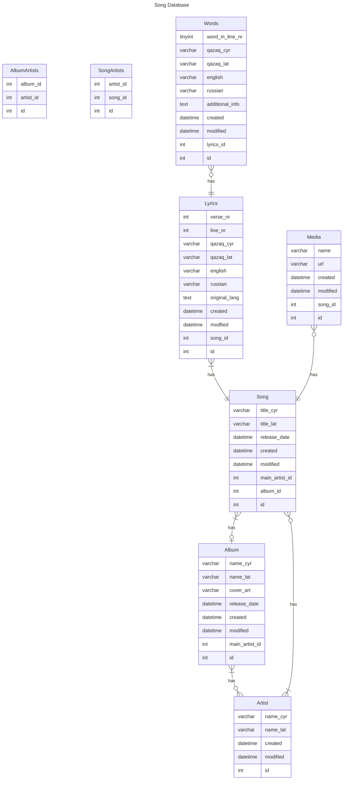

# Qazaq Genius Lyrics API
This is the implementation of the lyrics api for the Qazaq Genius website.

## 👨‍💻 Technologies Used
* [Slim-Framework 4](https://www.slimframework.com/)
* [PHP 8.2](https://www.php.net/)
* [MySQL 8.0](https://www.mysql.com/)
* [Docker](https://www.docker.com/get-started)
* [Composer](https://getcomposer.org/)
* [OpenAPI](https://spec.openapis.org/oas/v3.1.0)
* [Swagger](https://swagger.io/)

## Developement
0. Have [Docker](https://www.docker.com/get-started) and Make installed
1. Clone repository
2. Build and start the project
    1. `cd` into the project folder
    2. `make build_dev` to build the docker images
    3. `make install` to install the dependencies
    4. `make start` to fire up the project
3. Open a new ticket (and in an ideal case a new feature-branch)
4. Write your code & tests
5. Please execute make `unit_test`, `make sniff` and `make sniffer_fix` before pushing your changes

## Deployment
There are currently 3 environments. 

* Intgeration: Gets deployed on every commit
* Staging: Gets deployed on every commit on master
* Live: Gets deployed ony by hand

## Documentation

Swagger documentation of the routes: https://swagger.r0.fyi/

### Database structure
