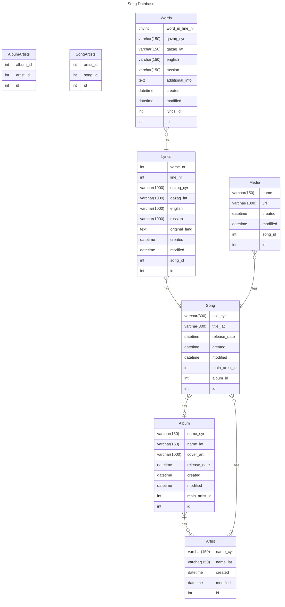

# Qazaq Genius

```mermaid
---
title: Song Database
---
erDiagram
Album {
	varchar(150)    name_cyr        
	varchar(150)    name_lat        
	varchar(1000)   cover_art       
	datetime        release_date    
	datetime	    created            
	datetime	    modified           
	int	            main_artist_id	
	int	            id              
}
AlbumArtists {
   int              album_id                    
   int              artist_id        
   int              id               
}
Artist {
   varchar(150)     name_cyr         
   varchar(150)     name_lat         
   datetime         created          
   datetime         modified         
   int              id               
}
Lyrics {
   int			    verse_nr         	
   int			    line_nr          	
   varchar(1000)    qazaq_cyr        
   varchar(1000)    qazaq_lat        
   varchar(1000)    english            	
   varchar(1000)    russian          
   text             original_lang    
   datetime         created          
   datetime         modfied          
   int              song_id          
   int	            id               	
}
Media {
	varchar(150)    name             	
	varchar(1000)   url               	
	datetime	    created              	
	datetime	    modified             	
	int	            song_id         	
	int	            id              	
}
Song {
   varchar(300)     title_cyr      
   varchar(300)     title_lat      
   datetime         release_date   
   datetime	        created        
   datetime	        modified       
   int	            main_artist_id 
   int	            album_id       
   int	            id             
}
SongArtists {
   int              artist_id        	         
   int              song_id          	         
   int              id               	         
}
Words {
   tinyint	        word_in_line_nr    
   varchar(150)     qazaq_cyr           
   varchar(150)     qazaq_lat           
   varchar(150)     english             
   varchar(150)     russian             
   text             additional_info     
   datetime         created             
   datetime         modified            
   int              lyrics_id           
   int              id                  
}

Album        }|--o{  Artist : has
Lyrics       }|--||    Song : has
Media        }o--||    Song : has
Song         }|--o|   Album : has
Song         }o--|{  Artist : has
Words        }o--||  Lyrics : has
```